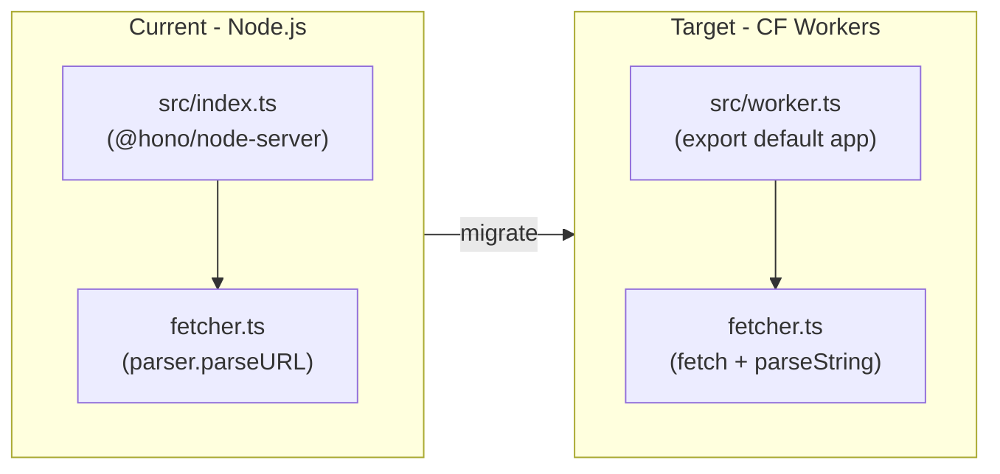

# Deploy RSS Filter to Cloudflare Workers

## What needs to change




## Step-by-step changes

### 1. Install Wrangler

```bash
pnpm add -D wrangler @cloudflare/workers-types
```

### 2. Create `wrangler.toml`

New file at the project root:

```toml
name = "rss-filter"
main = "src/worker.ts"
compatibility_date = "2025-01-01"
compatibility_flags = ["nodejs_compat"]
```

`nodejs_compat` is needed so `rss-parser`'s XML dependencies (`sax`, `xml2js`) resolve correctly in the Workers runtime.

### 3. Create `src/worker.ts` (new Workers entry point)

Replace the Node-server bootstrap with a plain Hono default export — all that CF Workers needs:

```typescript
import { Hono } from 'hono';
import { feedRoute } from './routes/feed.js';

const app = new Hono();

app.get('/', (c) =>
  c.json({
    message: 'RSS Filter API',
    endpoints: {
      feed: 'GET /feed?url=<rss-url>&include=...',
    },
  })
);

app.route('/feed', feedRoute);

export default app;
```

`src/index.ts` (the Node.js server) is left untouched — it continues to work for local `pnpm dev`.

### 4. Fix `src/services/fetcher.ts`

`parser.parseURL(url)` uses Node's `http`/`https` internally, which fails in Workers. Replace it with a Web `fetch()` call + `parser.parseString()`:

```typescript
import Parser from 'rss-parser';
import type { FeedItem } from '../types.js';

const parser = new Parser({
  customFields: { item: ['content:encoded', 'dc:creator'] },
});

export async function fetchFeed(url: string): Promise<FeedItem[]> {
  const response = await fetch(url);               // Web fetch API
  if (!response.ok) throw new Error(`Failed to fetch feed: ${response.status}`);
  const xml = await response.text();
  const feed = await parser.parseString(xml);      // no Node http needed

  return feed.items.map((item) => ({
    title: item.title || '',
    link: item.link || '',
    pubDate: item.pubDate,
    content: item['content:encoded'] || item.content || '',
    contentSnippet: item.contentSnippet || item.content || '',
    description: item.contentSnippet || item.content || item.description || '',
  }));
}
```

### 5. Update `package.json` scripts

Add wrangler scripts alongside the existing ones:

```json
"worker:dev": "wrangler dev src/worker.ts",
"worker:deploy": "wrangler deploy"
```

### 6. Deploy

```bash
# One-time login
pnpm wrangler login

# Local preview (Workers runtime)
pnpm worker:dev

# Deploy to production
pnpm worker:deploy
```

## File summary


| File                      | Action                                       |
| ------------------------- | -------------------------------------------- |
| `wrangler.toml`           | Create new                                   |
| `src/worker.ts`           | Create new (CF entry point)                  |
| `src/services/fetcher.ts` | Edit: `parseURL` → `fetch` + `parseString`   |
| `package.json`            | Edit: add wrangler dev dependency + scripts  |
| `src/index.ts`            | No change (keeps Node.js dev server working) |
