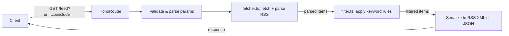

# RSS Feed Filter API (Hono + Node.js)

## Stack

- **Runtime:** Node.js with `@hono/node-server`
- **Framework:** Hono (TypeScript-first, fast)
- **RSS Parsing:** `rss-parser` (handles RSS 2.0 + Atom)
- **Dev:** `tsx` (run TS directly), `tsup` (build)

## Project Structure

```
rss-filter/
├── src/
│   ├── index.ts           # Entry point + server bootstrap
│   ├── routes/
│   │   └── feed.ts        # GET /feed route + validation
│   ├── services/
│   │   ├── fetcher.ts     # Fetch + parse remote RSS feed
│   │   └── filter.ts      # Keyword filtering logic
│   └── types.ts           # Shared types/interfaces
├── package.json
├── tsconfig.json
└── README.md
```

## API Design

**Endpoint:** `GET /feed`


| Param            | Required | Description                                                              |
| ---------------- | -------- | ------------------------------------------------------------------------ |
| `url`            | yes      | Remote RSS/Atom feed URL                                                 |
| `include`        | no       | Comma-separated keywords; item must match at least one                   |
| `exclude`        | no       | Comma-separated keywords; items matching any are removed                 |
| `match`          | no       | `any` (OR, default) or `all` (AND) for `include` terms                   |
| `fields`         | no       | Fields to search: `title`, `description`, `content` (default: all three) |
| `case_sensitive` | no       | `true` / `false` (default: `false`)                                      |
| `format`         | no       | `rss` (default, returns XML) or `json`                                   |


**Example requests:**

```
GET /feed?url=https://hnrss.org/newest&include=typescript,rust&match=any
GET /feed?url=https://hnrss.org/newest&include=AI&exclude=sponsored&format=json
GET /feed?url=https://hnrss.org/newest&include=node,bun&match=all&fields=title
```

## Data Flow




## Filter Logic (filter.ts)

- Split each comma-separated param into a keywords array
- Per item: search across specified `fields` (title, description, content)
- `include` + `match=any`: item passes if any keyword found in any field (OR)
- `include` + `match=all`: item passes only if every keyword found (AND)
- `exclude`: item is removed if any exclude keyword is found
- Case folding applied when `case_sensitive=false`

## Key Files

- `[src/index.ts](src/index.ts)` - creates Hono app, mounts routes, starts `@hono/node-server` on port 3015
- `[src/routes/feed.ts](src/routes/feed.ts)` - validates query params with Hono's `zValidator` + `zod`, calls services
- `[src/services/fetcher.ts](src/services/fetcher.ts)` - wraps `rss-parser`, returns normalized items
- `[src/services/filter.ts](src/services/filter.ts)` - pure filtering function, easy to unit test
- `[src/types.ts](src/types.ts)` - `FilterParams`, `FeedItem` interfaces

## Scripts

```json
"scripts": {
  "dev": "tsx watch src/index.ts",
  "build": "tsup src/index.ts --format cjs --dts",
  "start": "node dist/index.js"
}
```
